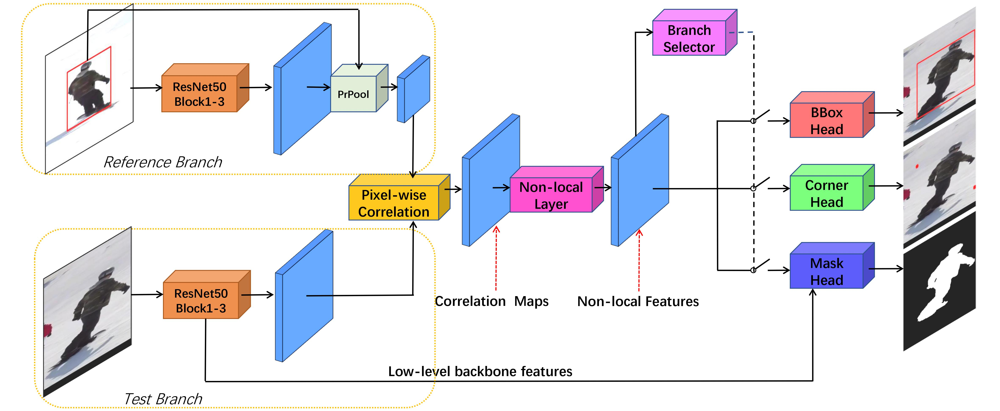

# Alpha-Refine: Boosting Tracking Performance by Precise Bounding Box Estimation

- The complete code and trained model will be released  

## Introduction
**Alpha-Refine** is an accurate, fast, and general refinement module. When combined with existing base trackers, 
Alpha-Refine can significantly boost their tracking performance, in no need of joint training or fine-tuning.

## Architecture
The overall architecture is shown below

  

## Video Demos  

  

More video demos can be found at [Google Drive](https://drive.google.com/file/d/1VnC_BkLEcaRc5BRxkDKdvnsKkrFKp49K/view?usp=sharing), [Baidu](https://pan.baidu.com/s/1pnIoFbNoUrIDHP1R-HoKHA)(extraction code:q5fs)  

