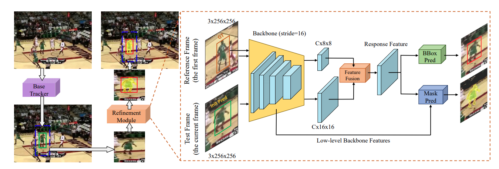

# Alpha-Refine

This is the official implementation of [Alpha-Refine: Boosting Tracking Performance by Precise Bounding Box Estimation
](https://arxiv.org/abs/2012.06815).


## News
- A TensorRT optimized version of AlphaRefine is available [here](https://github.com/ymzis69/AlphaRefine_TensorRT).
- The code for **CVPR2021** is updated. The old version is still available by
        
        git clone -b vot2020 https://github.com/MasterBin-IIAU/AlphaRefine.git 
- AlphaRefine is accepted by the **CVPR2021**
- :trophy: **Alpha-Refine wins VOT2020 Real-Time Challenge with EAOMultistart 0.499!** 
- VOT2020 winner presentation [slide](VOT20-RT-Report.pdf) has been uploaded.**


## Setup and Test

### Install AlphaRefine
  
```bash
git clone https://github.com/MasterBin-IIAU/AlphaRefine.git
cd AlphaRefine
```
Run the installation script to install all the dependencies. You need to provide the `${conda_install_path}`
(e.g. `~/anaconda3`) and the name `${env_name}` for the created conda environment (e.g. `alpha`).
```
# install dependencies
bash install.sh ${conda_install_path} ${env_name}
conda activate alpha
python setup.py develop
```  

### Download AlphaRefine Models
We provide the models of *AlphaRefine* here. The **AUC** and **Latency** are tested with SiamRPN++ as the base tracker
on *LaSOT* dataset, using a RTX 2080Ti GPU.

We recommend download the model into `ltr/checkpoints/ltr/SEx_beta`. 

| Tracker        | Backbone         | Latency     | AUC(%)   |  Model  |
|:--------------:|:----------------:|:-----------:|:-----------:|:----------------:|
| AR34<sub>c+m</sub> | ResNet34     |  5.1ms  |  55.9  |   [model](https://drive.google.com/file/d/1drLqNq4r9g4ZqGtOGuuLCmHJDh20Fu1m/view?usp=sharing)|
| AR18<sub>c+m</sub> | ResNet18     |  4.2ms  |  55.0  |   [model](https://drive.google.com/file/d/1ANf0KCvlFBbGQPpvT-3WNiy414ANkgLZ/view?usp=sharing)|

When combined with more powerful base trackers, 
*AlphaRefine* leads to very competitive tracking systems (e.g. *ARDiMP*). 
Following are some of the best performed trackers on LaSOT. 
More results are present in [Performance](#performance)

| Tracker                   | AUC(%)    | Speed (fps) | Paper/Code |
|:-----------               |:----------------:|:----------------:|:----------------:|
| ARDiMP (ours)             | 65.4  |  32 (RTX 2080Ti)  |   [Paper](https://arxiv.org/abs/2012.06815)/[Result](https://drive.google.com/file/d/1UNPwz7qP8SeBTxHF_Cw0JLmrN1jTqJJE/view?usp=sharing) |
| Siam R-CNN (CVPR20)       | 64.8  |  5 (Tesla V100)   |   [Paper](https://arxiv.org/pdf/1911.12836.pdf)/[Code](https://github.com/VisualComputingInstitute/SiamR-CNN) |
| DimpSuper                 | 63.1  |  39 (RTX 2080Ti)  |   [Paper](https://arxiv.org/pdf/2003.12565.pdf)/[Code](https://github.com/visionml/pytracking)  |
| ARDiMP50 (ours)           | 60.2  |  46 (RTX 2080Ti)  |   [Paper](https://arxiv.org/abs/2012.06815)/[Result](https://drive.google.com/file/d/1wJc_-1lCxeGlqEAKd1qER1x_4bWAhujv/view?usp=sharing)  |
| PrDiMP50 (CVPR20)         | 59.8  |  30 (Unkown GPU)  |   [Paper](https://arxiv.org/pdf/2003.12565.pdf)/[Code](https://github.com/visionml/pytracking)  |
| LTMU (CVPR20)             | 57.2  |  13 (RTX 2080Ti)  |   [Paper](https://arxiv.org/abs/2004.00305)/[Code](https://github.com/Daikenan/LTMU) |


### Establish Base Trackers
In this project, we introduce DiMP50, DiMPsuper, ATOM, ECO, RTMDNet, SiamRPN++ as our base trackers.

#### PyTracking Methods
DiMP50, DiMPsuper, ATOM, ECO are trackers from [PyTracking](pytracking).

The base tracker models trained using PyTracking can be download from [model zoo](https://github.com/visionml/pytracking/blob/master/MODEL_ZOO.md), download them into `pytracking/networks` 

Or you can run the following script to download the models.

```
echo "****************** Downloading networks ******************"
mkdir pytracking/networks

echo "****************** DiMP Network ******************"
gdown https://drive.google.com/uc\?id\=1qgachgqks2UGjKx-GdO1qylBDdB1f9KN -O pytracking/networks/dimp50.pth
gdown https://drive.google.com/uc\?id\=1MAjrRJDCbL0DSjUKFyDkUuYS1-cYBNjk -O pytracking/networks/dimp18.pth
gdown https://drive.google.com/open?id=1qDptswis2FxihLRYLVRGDvx6aUoAVVLv -O pytracking/networks/super_dimp.pth

echo "****************** ATOM Network ******************"
gdown https://drive.google.com/uc\?id\=1VNyr-Ds0khjM0zaq6lU-xfY74-iWxBvU -O pytracking/networks/atom_default.pth

echo "****************** ECO Network ******************"
gdown https://drive.google.com/uc\?id\=1aWC4waLv_te-BULoy0k-n_zS-ONms21S -O pytracking/networks/resnet18_vggmconv1.pth
```

#### [Optional] Other Base Trackers
Please refer to [external/pysot/README.md](external/pysot/README.md) for establishing SiamRPN++ and
[external/RT_MDNet/README.md](external/RT_MDNet/README.md) for establishing RTMDNet.


### Run Evaluation Scripts

* We provide the evaluation recipes of [LaSOT](doc/arena/LaSOT.md) | [GOT-10K](doc/arena/GOT-10K.md) | 
[TrackingNet](doc/arena/TrackingNet.md) | [VOT2020](doc/arena/VOT2020.md).
    You can follow these recipes to run the evaluation scripts.

* For some of the testing scripts, the path to the testing sets should be specified in `pytracking/evaluation/local.py`
    
    If `pytracking/evaluation/local.py` is not exist, please run
    ```
    python -c "from pytracking.evaluation.environment import create_default_local_file; create_default_local_file()"
    ```
    An example of `pytracking/evaluation/local.py.example` is provided.

## Train

The training code is based on [Pytracking](https://github.com/visionml/pytracking.git), thus the training operation is similar.

### Dataset

* Download the Dataset
    [GOT-10K](http://got-10k.aitestunion.com/downloads) |
    [LaSOT](http://vision.cs.stonybrook.edu/~lasot/download.html) |
    [MS-COCO](http://cocodataset.org/#home) |
    [ILSVRC-VID](http://image-net.org/challenges/LSVRC/2017/) |
    [ImageNet-DET](http://image-net.org/challenges/LSVRC/2017/) |
    [YouTube-VOS](https://youtube-vos.org) |
    [Saliency](https://drive.google.com/file/d/1bvaJwL8n3xFC9s13KZLTV102pZLo1IT1/view?usp=sharing)
    
    For more details, you can refer to [ltr/README.md](https://github.com/visionml/pytracking/tree/master/ltr#overview)
    

* The path to the training sets should be specified in `ltr/admin/local.py`
    
    If the `ltr/admin/local.py` is not exist, please run 
    ``` bash
    python -c "from ltr.admin.environment import create_default_local_file; create_default_local_file()"
    ```
    An example `ltr/admin/local.py.example` is also provided.
    

### Run Training Scripts

The training recipes are placed in `ltr/train_settings` (e.g. `ltr/train_settings/SEx_beta/SEcm_r34.py`), you can
configure the *training parameters* and *Dataloaders*. 

For a recipe named `ltr/train_settings/$sub1/$sub2.py`, run the following command to launch the training procedure.
```
python -m torch.distributed.launch --nproc_per_node=8 \
        run_training_multigpu.py $sub1 $sub2 
```
The checkpoints will be saved in `AlphaRefine/checkpoints/ltr/$sub1/$sub2/SEcmnet_ep00*.pth.tar`.


## Performance

When combined with more powerful base trackers, 
*AlphaRefine* leads to very competitive tracking systems (e.g. *ARDiMP*).
For more performance reports, please refer to our [paper](https://arxiv.org/abs/2012.06815)

* **LaSOT**

     | Tracker                   | Success Score    | Speed (fps) | Paper/Code |
     |:-----------               |:----------------:|:----------------:|:----------------:|
     | ARDiMP (ours)             | 0.654  |  32 (RTX 2080Ti)  |   [Paper](https://arxiv.org/abs/2012.06815)/[Result](https://drive.google.com/file/d/1UNPwz7qP8SeBTxHF_Cw0JLmrN1jTqJJE/view?usp=sharing) |
     | Siam R-CNN (CVPR20)       | 0.648  |  5 (Tesla V100)   |   [Paper](https://arxiv.org/pdf/1911.12836.pdf)/[Code](https://github.com/VisualComputingInstitute/SiamR-CNN) |
     | DimpSuper                 | 0.631  |  39 (RTX 2080Ti)  |   [Paper](https://arxiv.org/pdf/2003.12565.pdf)/[Code](https://github.com/visionml/pytracking)  |
     | ARDiMP50 (ours)           | 0.602  |  46 (RTX 2080Ti)  |   [Paper](https://arxiv.org/abs/2012.06815)/[Result](https://drive.google.com/file/d/1wJc_-1lCxeGlqEAKd1qER1x_4bWAhujv/view?usp=sharing)  |
     | PrDiMP50 (CVPR20)         | 0.598  |  30 (Unkown GPU)  |   [Paper](https://arxiv.org/pdf/2003.12565.pdf)/[Code](https://github.com/visionml/pytracking)  |
     | LTMU (CVPR20)             | 0.572  |  13 (RTX 2080Ti)  |   [Paper](https://arxiv.org/abs/2004.00305)/[Code](https://github.com/Daikenan/LTMU) |
     | DiMP50 (ICCV19)           | 0.568  |  59 (RTX 2080Ti)  |   [Paper](https://arxiv.org/pdf/1904.07220.pdf)/[Code](https://github.com/visionml/pytracking)  |
     | Ocean (ECCV20)            | 0.560  |  25 (Tesla V100)  |   [Paper](https://arxiv.org/abs/2006.10721)/[Code](https://github.com/researchmm/TracKit) |  
     | ARSiamRPN (ours)          | 0.560  |  50 (RTX 2080Ti)  |   [Paper](https://arxiv.org/abs/2012.06815)/[Result](https://drive.google.com/file/d/1u-ou43O_RU9oRFx1UKjzeYe6e-4qnMZZ/view?usp=sharing) |  
     | SiamAttn (CVPR20)         | 0.560  |  45 (RTX 2080Ti)  |   [Paper](https://arxiv.org/pdf/2004.06711.pdf)/[Code]() |
     | SiamFC++GoogLeNet (AAAI20)| 0.544  |  90 (RTX 2080Ti)  |   [Paper](https://arxiv.org/pdf/1911.06188.pdf)/[Code](https://github.com/MegviiDetection/video_analyst) |
     | MAML-FCOS (CVPR20)        | 0.523  |  42 (NVIDIA P100) |   [Paper](https://arxiv.org/pdf/2004.00830.pdf)/[Code]() |
     | GlobalTrack (AAAI20)      | 0.521  |  6 (GTX TitanX)   |   [Paper](https://arxiv.org/abs/1912.08531)/[Code](https://github.com/huanglianghua/GlobalTrack) |
     | ATOM (CVPR19)             | 0.515  |  30 (GTX 1080)    |   [Paper](https://arxiv.org/pdf/1811.07628.pdf)/[Code](https://github.com/visionml/pytracking)  |


## Acknowledgments
* This repo is based on [Pytracking](https://github.com/visionml/pytracking.git) which is an exellent work.
* Thanks for [pysot](https://github.com/STVIR/pysot) and [RTMDNet](https://github.com/IlchaeJung/RT-MDNet) from which
 we borrow the code as base trackers.

